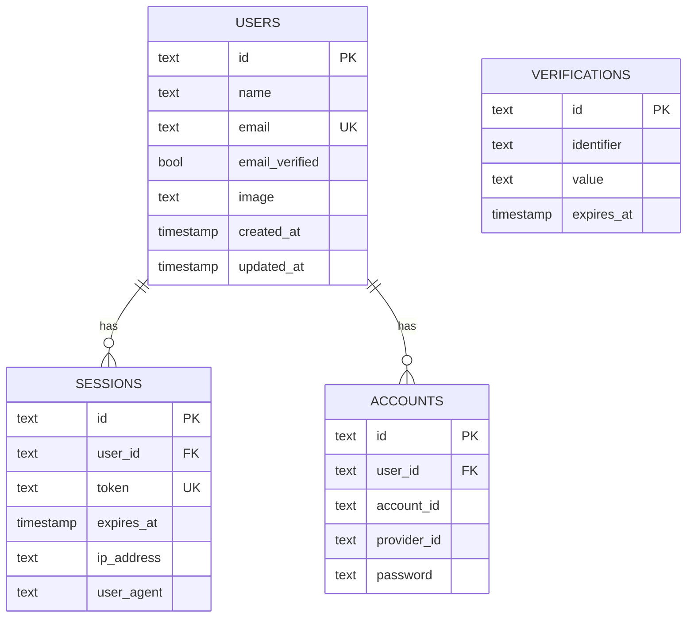
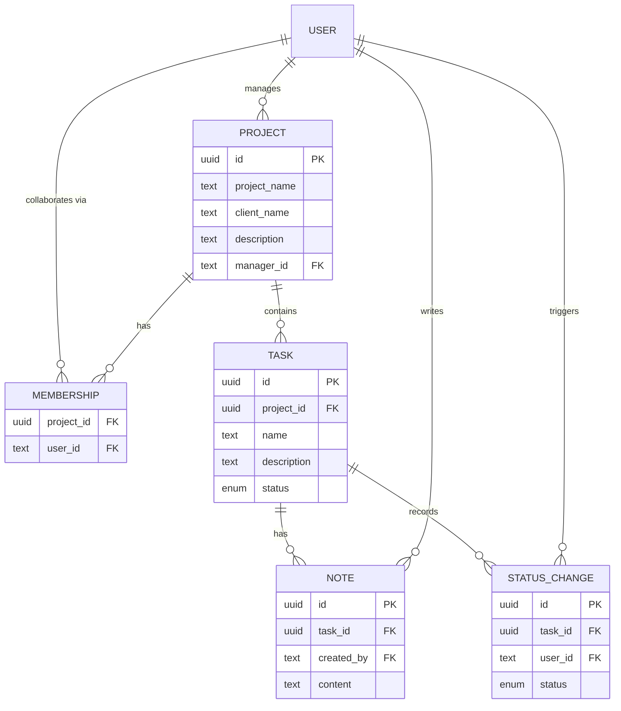

<p align="center">
  
</p>

<p align="center">
  <strong>Collaborative project and task management for small teams.</strong>
</p>

<p align="center">
  
  
  
  
  
  
  
  
</p>

---

## Overview

UpTask lets a team plan work as **projects**, break each project into **tasks**, move those tasks across a kanban board, and discuss them through **notes**. Every project has a manager who owns it and a set of collaborators who work on it, with permissions enforced on the server.

> [!NOTE]
> **Project status: auth layer complete, product features in progress.**
> Sign-up with email confirmation, sign-in, and password reset are wired end to end against Better Auth, Drizzle, and a real Postgres database. The authenticated app shell is scaffolded but its navigation targets are placeholders. Projects, tasks, team management, and notes are not built yet — see the [Roadmap](#roadmap).

## Features

Legend: **shipped** · **partial** · **not built**

**Accounts**
- Registration with email confirmation (confirmation is required before the first sign-in)
- Sign-in with session cookies issued by Better Auth
- Forgot-password and reset-password flows, with a neutral response that never reveals whether an email is registered
- Confirmation email is re-sent automatically on a sign-in attempt by an unverified account; there is no explicit "resend" screen
- Sign-out, route protection for authenticated pages
- Profile editing and password change

**App shell**
- Responsive top navigation with a mobile disclosure panel and a user dropdown
- Route-level loading skeletons, plus global error and not-found pages
- Nav links (Projects, My tasks) and the user menu are placeholders pointing at `#`; the avatar and user name are hardcoded

**Projects**
- Create, edit, and delete projects (name, client, description)
- Dashboard listing every project the user manages or collaborates on
- Deleting a project cascades to its tasks and their notes

**Tasks**
- Kanban board across five columns: Pending, On Hold, In Progress, Under Review, Completed
- Drag and drop to change status
- Task detail with description and full edit
- Change history — who moved the task to which status, and when

**Team**
- Look up users by email and add them to a project
- List and remove collaborators
- Manager-only actions (edit/delete project, create/edit/delete tasks) enforced server-side; collaborators can move tasks and write notes

**Notes**
- Threaded notes per task
- Authors can delete their own notes

## Tech stack

| Layer | Choice | Notes |
| --- | --- | --- |
| Framework | [Next.js 16](https://nextjs.org) (App Router) | Server Components, Server Actions, `typedRoutes` enabled |
| UI | [React 19](https://react.dev) + [Tailwind CSS 4](https://tailwindcss.com) | CSS-first Tailwind config in `app/globals.css` |
| Components | [Headless UI](https://headlessui.com) + [Heroicons](https://heroicons.com) | Unstyled primitives for the nav, menus, and disclosures |
| Motion | [Motion](https://motion.dev) | Available; not yet used in shipped screens |
| Toasts | [Sonner](https://sonner.emilkowal.ski) | Single `<Toaster>` mounted in the root layout |
| Forms | [React Hook Form](https://react-hook-form.com) | Paired with Zod via `@hookform/resolvers` |
| Validation | [Zod 4](https://zod.dev) | One schema per operation, reused on the client and re-checked in the server action |
| Auth | [Better Auth](https://better-auth.com) | Email/password, verification, reset, sessions, Next.js cookie plugin |
| ORM | [Drizzle ORM 1.0 RC](https://orm.drizzle.team) | Relational queries via `defineRelations`; `drizzle-kit` migrations |
| Database | [Neon](https://neon.tech) Postgres | Connected over the `neon-http` serverless driver |
| Email | [React Email](https://react.email) + [Nodemailer](https://nodemailer.com) | JSX templates rendered to HTML, sent over SMTP |
| Language | [TypeScript](https://www.typescriptlang.org) | `strict` mode |
| Linting | [ESLint 9](https://eslint.org) + `@stylistic` | Flat config; double quotes, semicolons required |
| Package manager | [pnpm](https://pnpm.io) | Enforced by a `preinstall` hook |

> [!IMPORTANT]
> The database client is `drizzle-orm/neon-http`, which speaks Neon's HTTP protocol — not the standard Postgres wire protocol. A plain local `postgres://` instance will not connect. Use a Neon database, or swap `src/db/index.ts` to the `node-postgres` driver if you want to run against local Postgres.

## Architecture

The app is organised feature-first under `src/`, with a deliberate one-way dependency: **route → action → service → repository → database**.

```
Server Action        validates input with a Zod schema, returns ActionResult
  └─ Service         orchestrates Better Auth, maps errors to user-facing copy
      └─ Repository  the only layer that touches Drizzle
```

A few conventions worth knowing before adding a feature:

- **Every mutation returns `ActionResult`** (`src/shared/types/result.ts`) — a discriminated union of `{ ok: true, message? }` and `{ ok: false, error }`, built with the `actionOk` / `actionError` helpers. Actions never throw at the client; forms branch on `response.ok` and hand the string to Sonner.
- **Schemas are validated twice.** The same Zod schema drives the React Hook Form resolver and re-runs inside the server action, so a crafted request can't bypass the client check.
- **Error copy lives in the service, not the component.** `AuthService` catches Better Auth's `APIError` and translates it into a sentence a user can act on.
- **Environment variables are validated at boot.** `src/lib/env.ts` parses `process.env` through a Zod schema and throws on a bad value. It's imported from `next.config.ts` and from `instrumentation.ts`, so a missing secret fails the build and the server start rather than surfacing as a runtime error later.
- **Repositories are interface-backed** (`IAuthRepository`) and injected into services through the constructor, so a service can be tested against a fake.

User-facing strings are specified ahead of implementation in `docs/COPY.md` — that file is the source of truth for wording, and it is intentionally untracked.

## Data model

### Shipped

Only the authentication tables exist today. They are generated to match Better Auth's expected shape, so primary keys are `text` (Better Auth's own ID format), not `uuid`.



`sessions` and `accounts` cascade on user deletion. `verifications` holds email-confirmation and password-reset tokens and is keyed by identifier rather than by a user foreign key.

### Planned

The product tables below are designed but not yet implemented.



Project membership and task status history are modelled as join tables rather than embedded lists, so both are enforced by foreign keys. Deleting a project will cascade to its tasks, and deleting a task will cascade to its notes and status history.

## Getting started

### Prerequisites

- **Node.js 20+** (developed on 24)
- **pnpm 11+** — `npm install -g pnpm`
- A **[Neon](https://neon.tech) Postgres database** — see the note in [Tech stack](#tech-stack) about the HTTP driver
- An **SMTP account** for transactional email (Resend, Mailtrap, or any SMTP provider)

### Installation

```bash
git clone <your-repo-url> uptask
cd uptask
pnpm install
```

> This repository only allows pnpm. `npm install` and `yarn` are blocked by the `preinstall` hook.

### Environment variables

Copy the example file and fill it in:

```bash
cp .env.example .env
```

| Variable | Description |
| --- | --- |
| `APP_NAME` | Product name used in page titles and metadata — `UpTask` |
| `APP_URL` | Public base URL of the app, e.g. `http://localhost:3000` |
| `DATABASE_URL` | Neon connection string. Must start with `postgresql` |
| `BETTER_AUTH_SECRET` | Random 32+ character secret. Generate with `openssl rand -base64 32` |
| `BETTER_AUTH_URL` | Base URL Better Auth builds callback links from — `http://localhost:3000` in development |
| `SMTP_HOST` | SMTP server hostname |
| `SMTP_PORT` | SMTP port, typically `587` |
| `SMTP_USER` | SMTP username |
| `SMTP_PASS` | SMTP password |

All nine are required — `src/lib/env.ts` throws a formatted error listing every invalid or missing value, and the app will not start without them.

The **from** addresses on outgoing mail are not environment-driven; they live in `src/emails/config/index.ts`.

> [!WARNING]
> `.gitignore` currently ignores `.env` only. A file named `.env.local` — the name Next.js documentation usually suggests — **would be committed**. Keep your secrets in `.env`, or widen the ignore rule to `.env*` before creating any other env file.

### Database setup

There are no `db:` package scripts; invoke `drizzle-kit` directly. It reads `drizzle.config.ts`, which pulls `DATABASE_URL` through the validated env module.

```bash
pnpm exec drizzle-kit push       # push the schema straight to the database (development)
pnpm exec drizzle-kit studio     # optional: browse the data in Drizzle Studio
```

For anything deployed, generate and apply versioned migrations instead. They are written to `drizzle/`:

```bash
pnpm exec drizzle-kit generate   # write a migration from schema changes
pnpm exec drizzle-kit migrate    # apply pending migrations
```

### Run

```bash
pnpm dev
```

Open [http://localhost:3000](http://localhost:3000).

To exercise the full sign-up flow you need working SMTP credentials — email confirmation is required, so an unconfirmed account cannot sign in.

## Scripts

| Script | Description |
| --- | --- |
| `pnpm dev` | Start the development server |
| `pnpm build` | Production build |
| `pnpm start` | Serve the production build |
| `pnpm typecheck` | Run `tsc --noEmit` |
| `pnpm lint` | Run ESLint |
| `pnpm lint:fix` | Run ESLint and apply fixes |

Database commands go through `pnpm exec drizzle-kit <command>` — see [Database setup](#database-setup).

## Project structure

```
app/                              Routes only — no business logic
  (auth)/                         Authenticated app (route group, no URL segment)
    layout.tsx                    Top nav, user menu, mobile disclosure
    page.tsx                      Dashboard at /
    loading.tsx                   Dashboard skeleton
  auth/                           Unauthenticated screens at /auth/*
    layout.tsx                    Centred, logo-topped shell
    sign-in/  sign-up/
    forgot-password/  reset-password/
    loading.tsx                   Auth form skeleton
  api/auth/[...all]/route.ts      Better Auth catch-all handler
  layout.tsx                      Root layout — fonts, metadata, Toaster
  error.tsx                       Global 500 boundary
  not-found.tsx                   Global 404
  globals.css                     Tailwind entry point and design tokens

src/
  db/
    index.ts                      Drizzle client over the Neon HTTP driver
    schema/                       Table definitions
    relations/                    defineRelations graph for relational queries
  emails/
    templates/                    React Email JSX templates
    services/                     EmailService (transport) + AuthEmailService
    config/                       From addresses
  features/
    auth/
      actions/                    "use server" entry points
      services/                   AuthService + AuthRepository
      schemas/                    Zod schemas and inferred input types
      components/                 The four auth forms
  lib/
    auth.ts                       Better Auth configuration
    env.ts                        Zod-validated environment
    nodemailer.ts                 SMTP transport
  shared/
    components/forms/             Form, FormInput, FormLabel, FormError, FormSubmit
    components/typography/        Heading, UnderlineHeading
    components/ui/                Logo, LogoMark, Skeleton, Spinner
    types/result.ts               ActionResult
    utils/ui.ts                   classNames

drizzle/                          Generated migrations and snapshots
instrumentation.ts                Validates env on server startup
drizzle.config.ts                 drizzle-kit configuration
eslint.config.mjs                 Flat ESLint config
```

> [!NOTE]
> The `(auth)` route group holds the **authenticated** application, while the `auth/` directory holds the **authentication** screens. The names are similar and easy to confuse — `(auth)` is a group in parentheses and contributes nothing to the URL, so its `page.tsx` serves `/`.

## Design system

Tokens are declared with Tailwind 4's `@theme` block in `app/globals.css`:

- **`primary`** — a violet ramp (`primary-50` … `primary-950`) in OKLCH; `--color-primary` aliases `primary-400`
- **`secondary`** — a magenta ramp on the same scale; `--color-secondary` aliases `secondary-600`
- **Fonts** — [Rubik](https://fonts.google.com/specimen/Rubik) as `font-sans` (the default) and [Geist](https://vercel.com/font) as `font-serif`, both loaded through `next/font/google`

Shared UI lives in `src/shared/components/`:

- **`Heading`** — one component for `h1`–`h6`, with size and weight mapped per level rather than passed as classes
- **`UnderlineHeading`** — a heading whose final phrase carries a hand-drawn SVG underline from `public/assets/`
- **`Skeleton`** — the pulse placeholder used by the `loading.tsx` files
- **Form primitives** — `Form`, `FormLabel`, `FormInput`, `FormError`, `FormSubmit`, re-exported from a barrel. `FormInput` takes an `error` boolean for its invalid state; `FormSubmit` takes `loading` and renders a `Spinner`.

`public/assets/` holds a large library of decorative SVGs (underlines, arrows, blobs, scribbles) and is untracked.

## Code style

Enforced by ESLint, not by convention:

- **Double quotes** — `@stylistic/quotes` (`avoidEscape` is on, so `'He said "hi"'` is fine)
- **Semicolons required** — `@stylistic/semi`
- **Double quotes in JSX attributes** — `@stylistic/jsx-quotes`

All three are auto-fixable; run `pnpm lint:fix` before committing.

Not enforced by the linter but consistent across the codebase: **four-space indentation** in `src/`, named default exports for components, and imports ordered framework → third-party → local.

Commits follow [Conventional Commits](https://www.conventionalcommits.org) with a scope — `feat(auth):`, `fix(lint):`, `chore:`.

## Roadmap

- [x] Next.js 16 + Tailwind CSS 4 scaffold
- [x] Branding — logo, app icon, color tokens
- [x] ESLint flat config with enforced formatting rules
- [x] Zod-validated environment variables, checked at build and startup
- [x] Drizzle schema, database client, and migrations
- [x] Better Auth — registration, email verification, sign-in, password reset
- [x] Shared Zod schemas and React Hook Form integration
- [x] Transactional email templates (React Email + Nodemailer)
- [x] Authenticated app shell with top navigation
- [x] Loading skeletons, error boundary, and not-found page
- [ ] Session-aware navigation — real user data, working sign-out
- [ ] Route protection for authenticated pages
- [ ] Projects — CRUD and dashboard
- [ ] Team management and server-side authorization policies
- [ ] Tasks — CRUD, kanban board, drag and drop
- [ ] Task status history
- [ ] Notes
- [ ] Profile and password management
- [ ] Deployment

## License

[MIT](LICENSE)
