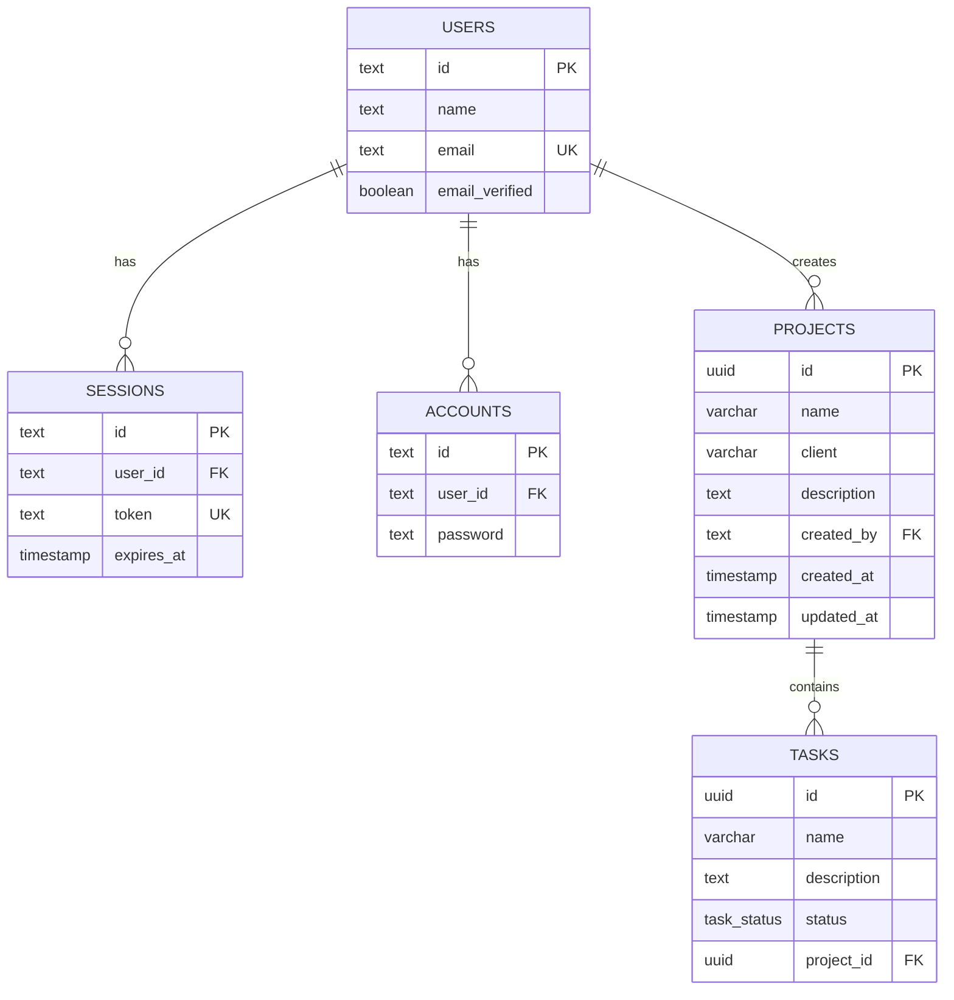

<p align="center">
  
</p>

<p align="center">
  <strong>Project and task management for small teams.</strong>
</p>

<p align="center">
  
  
  
  
  
</p>

## Status

UpTask has a complete email/password authentication flow and an initial project-management flow. Users can create, browse, edit, and delete their own projects; project lists are paginated. A project detail page includes an overview and a dialog for creating tasks.

The dashboard, task board, collaboration, notes, notifications, profile/settings, and task-management features are still in progress. Their navigation or visual placeholders do not imply that the feature is implemented.

## Features

### Implemented

- Email/password registration with email verification
- Sign-in, sign-out, password reset, and session cookies managed by Better Auth
- Protected authenticated routes
- Responsive authenticated navigation, loading skeletons, and global error/not-found screens
- Create, list, view, edit, and delete projects owned by the current user
- Server-side project ownership checks for reads, updates, and deletes
- Project pagination using the `page` query parameter
- Project overview with client, manager, and creation date
- Create a task for a project; new tasks default to `PENDING`
- Transactional verification and password-reset emails

### In progress

- Project collaborators and team management
- Listing, editing, deleting, assigning, and moving tasks
- Kanban board, drag and drop, and task history
- Dashboard and My Tasks data
- Notes, notifications, profile, and settings
- Project task counts and progress indicators

## Tech stack

| Layer | Choice |
| --- | --- |
| Framework | Next.js 16 App Router |
| UI | React 19 and Tailwind CSS 4 |
| Forms and validation | React Hook Form, Zod, and `@hookform/resolvers` |
| Authentication | Better Auth with the Next.js cookie plugin |
| Database | Neon Postgres through Drizzle ORM |
| Email | React Email and Nodemailer over SMTP |
| UI primitives | Headless UI, Heroicons, Sonner, and Zustand |
| Language and tooling | TypeScript, ESLint, pnpm |

> [!IMPORTANT]
> The database client uses Drizzle's `neon-http` driver. It expects a Neon-compatible PostgreSQL connection string; it does not speak the standard local Postgres wire protocol.

## Architecture

The application is organised by feature under `src/`. Data-changing flows follow this direction:

```text
Client form
  → Server Action or Route Handler
  → Service
  → Repository
  → Drizzle ORM
  → PostgreSQL
```

- **Client components** manage interaction: forms, dialogs, URL controls, toasts, and local Zustand state.
- **Server actions** authenticate where required and validate inputs again with Zod.
- **Services** own use-case logic and depend on repository interfaces.
- **Repositories** are the only layer that uses Drizzle directly.
- **`ActionResult`** gives forms a predictable `{ ok, message/error }` response shape.

This keeps browser input separate from authorization and database access. Client-side validation improves UX; server-side validation and ownership checks protect the data.

## Data model



Deleting a user cascades to their sessions, accounts, and projects. Deleting a project cascades to its tasks. The table definitions live in `src/db/schema/`; generated migrations live in `drizzle/`.

## Routes

| URL | Purpose |
| --- | --- |
| `/auth/sign-up` | Register and request email verification |
| `/auth/sign-in` | Sign in |
| `/auth/forgot-password` | Request a reset link |
| `/auth/reset-password?token=…` | Set a new password |
| `/` | Dashboard placeholder |
| `/projects` | Paginated project list |
| `/projects/new` | Create a project |
| `/projects/[id]` | Project overview, tasks dialog, and team placeholder |
| `/projects/[id]/edit` | Edit a project |
| `/my-tasks` | My Tasks placeholder |
| `POST /api/user/projects` | Delete the current user's project |

`proxy.ts` performs the first route-protection check from the session cookie. Pages, actions, and route handlers still validate the session on the server before accessing protected data.

## Getting started

### Prerequisites

- Node.js 20+
- pnpm 11+
- A Neon Postgres database
- An SMTP account

### Install

```bash
git clone <your-repository-url> uptask
cd uptask
pnpm install
```

The repository only allows pnpm; the `preinstall` hook rejects npm and Yarn.

### Environment variables

Create `.env` with the following required values:

```dotenv
APP_NAME=UpTask
APP_URL=http://localhost:3000
DATABASE_URL=postgresql://...
BETTER_AUTH_SECRET=a-random-secret-with-at-least-32-characters
BETTER_AUTH_URL=http://localhost:3000
SMTP_HOST=smtp.example.com
SMTP_PORT=587
SMTP_USER=your-user
SMTP_PASS=your-password
```

`src/lib/env.ts` validates every value with Zod when the app starts. Keep environment files out of Git.

### Database

For local development, either push the schema directly or apply the existing migrations:

```bash
pnpm exec drizzle-kit push
pnpm migrate
```

When changing a schema, generate a new migration and apply it:

```bash
pnpm generate
pnpm migrate
```

### Run

```bash
pnpm dev
```

Open [http://localhost:3000](http://localhost:3000). A working SMTP configuration is necessary to complete account verification.

## Scripts

| Script | Description |
| --- | --- |
| `pnpm dev` | Start the development server |
| `pnpm build` | Create a production build |
| `pnpm start` | Run the production server |
| `pnpm typecheck` | Run TypeScript without emitting files |
| `pnpm lint` | Run ESLint |
| `pnpm lint:fix` | Apply ESLint fixes |
| `pnpm generate` | Generate a Drizzle migration |
| `pnpm migrate` | Apply pending Drizzle migrations |

## Project structure

```text
app/                              Next.js routes, layouts, loading, and errors
  (auth)/                         Authenticated route group; does not appear in URLs
  auth/                           Public authentication screens
  api/                            HTTP route handlers

src/
  db/                             Drizzle client, schema, and relations
  emails/                         React Email templates and SMTP services
  features/
    auth/                         Auth forms, actions, schemas, and services
    projects/                     Project forms, CRUD, pagination, and dialog state
    task/                         Task creation form, action, and repository
  lib/                            Auth, environment, and Nodemailer setup
  shared/                         Reusable UI, forms, types, and utilities

drizzle/                          Versioned SQL migrations and snapshots
proxy.ts                          Early request-level route protection
```

## Roadmap

- [x] Next.js, Tailwind, TypeScript, ESLint, and pnpm setup
- [x] Drizzle schema, migrations, and Neon connection
- [x] Better Auth with verification and password reset email
- [x] Authenticated application shell and route protection
- [x] Project CRUD and pagination
- [x] Initial task creation
- [ ] Collaborator and team model
- [ ] Complete task CRUD, authorization, and board
- [ ] Dashboard, My Tasks, and progress metrics
- [ ] Notes, notifications, profile, settings, and deployment

## License

[MIT](LICENSE)
